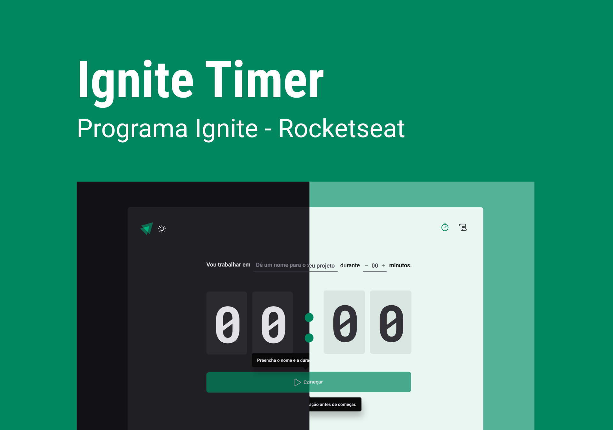

<h1 align="center">Ignite Timer</h1>

    Projeto pratico de treinamento by Ignite 💚

    <a href="#-tecnologias">Tecnologias</a>&nbsp;&nbsp;&nbsp;|&nbsp;&nbsp;&nbsp;
    <a href="#-projeto">Projeto</a>&nbsp;&nbsp;&nbsp;|&nbsp;&nbsp;&nbsp;
    <a href="#-layout">Layout</a>

 

    

## 🚀 Tecnologias

Esse projeto foi desenvolvido com as seguintes tecnologias:

- TypeScript
- ReactJS
- Vite
- Styled Components

## 💻 Projeto

O Ignite Timer é um projeto que simula um timer no estilo Pomodoro onde é possível o usuário adicionar uma tarefa e uma duração na qual ele deseja ficar focado. 

Após iniciar o Timer, a tarefa ficará no histórico para que o usuário consiga visualizar se a mesma foi concluída ou interrompida, ou se ainda esta em andamento.

Nesse projeto foi construído uma aplicação react utilizando typescript onde foi abordado conceitos como: 

- Styled Components
- React Hook Form
- Zod 
- React Router DOM
- Context API
- Use Reducer
- Imutabilidade utilizando Immer

## 📋 Layout 

Voce pode visualizar o layout do projeto através [DESSE LINK](https://www.figma.com/file/ZmLZBKtZSGgYGyz3JGRrxA/Ignite-Timer). É necessário ter uma conta no [Figma](https://figma.com) para acessa-lo.

---

Feito com 💜 by Phelipe Pereira :wave:
